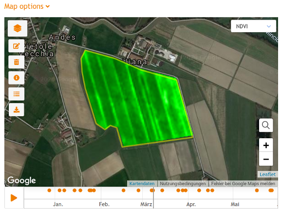

# gc-map widget v2
## Description
gc-map is an embeddable JavaScript/HTML widget for visualizing the outputs of the ag|knowledge REST API from [geocledian](https://www.geocledian.com).
It is built as a reusable [Vue.js](https://www.vuejs.org) component which allows the integration in [Vue.js](https://www.vuejs.org) applications smoothly. 
You may but you don't have to build the rest of the container application with [Vue.js](https://www.vuejs.org).

## Purpose
With this widget you are able to visualize a timeseries of satellite images of a registered parcel in a map. 
> **Please note** that the widget contains a DEMO API Key and a DEMO parcel. If you want to visualize your data it has to be registered first in the REST API of ag|knowledge from geocledian.com. <br> Contact us for getting an API Key and registering your data.

It is customizeable via HTML attributes and also offers a video mode.<br>



## Integration
For the integration of the widget you'll have to follow two steps.

You have to add some dependencies in the head tag of the container website.

```html
<html>
  <head>

  <!--GC map component begin -->

  <!-- loads also dependent css files via @import -->
  <link href="css/gc-map.css" rel="stylesheet">
  <!-- init script for components -->
  <script type="text/javascript" src="js/gc-map-init.js"></script>
  
  <!--GC map component end -->

  </head>

```

Then you may create the widget(s) with custom HTML tags anywhere in the body section of the website. Make sure to use a unique identifier for each map component (mapid). 

>If you want to change the id of the parent div ("gc-app") you'll have to change this divs' id also in the init script `gc-map-init.js`, method `initComponent()`.


```html
<div id="gc-app">
  <gc-map mapid="map1"
          gc-apikey="39553fb7-7f6f-4945-9b84-a4c8745bdbec" 
          gc-host="geocledian.com" 
          basemap="osm"
          parcel-id="4483">
  </gc-map>
  <gc-map mapid="map2"
          gc-apikey="39553fb7-7f6f-4945-9b84-a4c8745bdbec" 
          gc-host="geocledian.com" 
          basemap="google"
          parcel-id="4486">
  </gc-map>
</div>
```

> If you want to change the basemap to Google Maps or ESRI ArcGIS Online World Imagery Service please check their terms of use and legal issues first! <br> While ESRI does not restrict the use of ArcGIS Online World Imagery Service technically, there are [legal restrictions](https://www.esri.com/en-us/legal/terms/full-master-agreement).<p> **Please consult the terms of use first. geocledian is not responsible for illegal use of third party services!** <p> For using Google's basemap you'll have to uncomment the URL to Google Maps API and enter your valid Google Maps API key in the init script `gc-map-init.js` (YOUR_VALID_API_KEY_FROM_GOOGLE). For using ESRI ArcGIS Online World Imagery Service please check the source code of `gc-map.js` for enabling it.

```js
// init dependent javascript libs
const libs = ['https://unpkg.com/vue@2.6.11/dist/vue.min.js',
                'https://unpkg.com/leaflet@1.3.1/dist/leaflet.js',
                'https://cdnjs.cloudflare.com/ajax/libs/leaflet.draw/1.0.2/leaflet.draw.js',
                // Google API Key - uncomment the following two lines and enter your valid API Key here
                // 'https://maps.googleapis.com/maps/api/js?key=YOUR_VALID_API_KEY_FROM_GOOGLE', 
                // 'https://unpkg.com/leaflet.gridlayer.googlemutant@0.8.0/Leaflet.GoogleMutant.js',
                'https://unpkg.com/leaflet-geosearch@2.7.0/dist/bundle.min.js',
                'https://unpkg.com/vis-timeline@7.1.2/standalone/umd/vis-timeline-graph2d.min.js'
            ];
```

## Support
Please contact [us](mailto:info@geocledian.com) from geocledian.com if you have troubles using the widget!

## Used Libraries
- [Vue.js](https://www.vuejs.org)
- [Leaflet.js](https://leafletjs.com/)
- [Leaflet Draw Plugin](http://leaflet.github.io/Leaflet.draw/docs/leaflet-draw-latest.html)
- [Leaflet GeoSearch Plugin](https://github.com/smeijer/leaflet-geosearch)
- [vis.js](https://visjs.org/)

## Legal: Terms of use from third party data providers
- You have to add the copyright information of the used data. At the time of writing the following text has to be visible for [Landsat](https://www.usgs.gov/information-policies-and-instructions/crediting-usgs) and [Sentinel](https://scihub.copernicus.eu/twiki/pub/SciHubWebPortal/TermsConditions/TC_Sentinel_Data_31072014.pdf) data:

```html
 contains Copernicus data 2020.
 U.S. Geological Service Landsat 8 used in compiling this information.
```

- this widget allows using data from the Google Maps API technically. Please ensure the complicance of the [terms of use](https://developers.google.com/maps/terms-20180207#7.-permitted-uses.) first before using them.

- this widget allows the technical integration of ArcGIS Online Services - e.g. as the [World Imagery Service](https://server.arcgisonline.com/ArcGIS/rest/services/World_Imagery/MapServer/). Please ensure the complicance of the [terms of use](https://www.esri.com/en-us/legal/terms/full-master-agreement) first before using them. 

**geocledian is not responsible for illegal use of third party services.**